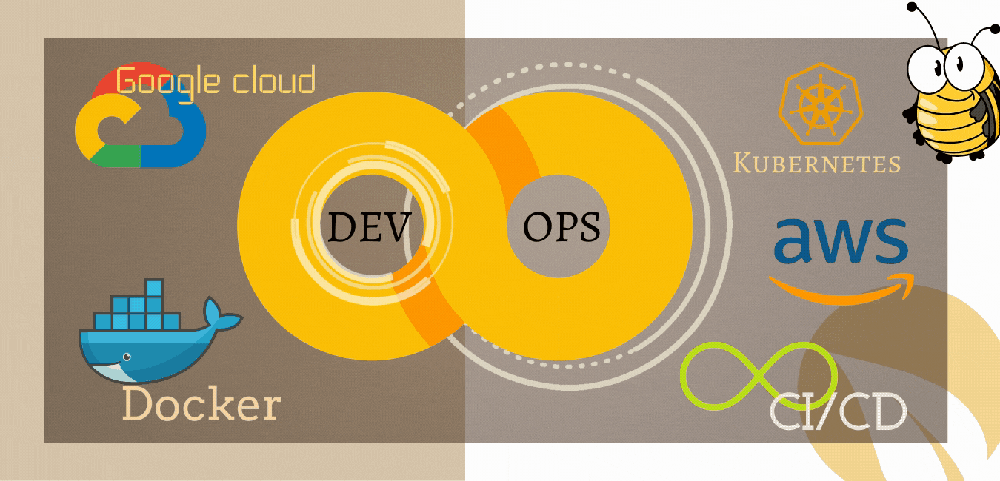

# 💻 Hi there, I'm Fahim 👋

🚀 **DevOps Engineer | Kubernetes Administrator | AWS, GCP & Azure Cloud Specialist**  
🌍 **Lahore, Pakistan**  
📧 **[fahim.devops@gmail.com](mailto:fahim.devops@gmail.com)**  
📞 **+92-323-9613313**  
🔗 **[LinkedIn](https://linkedin.com/in/fahim-ur-rehman)**  

---

## 🛠️ **About Me**  
I am a **Certified Kubernetes Administrator (CKA)** and **AWS Certified Solutions Architect** with over **7 years of experience** in delivering scalable, secure, and efficient solutions. My expertise spans a range of cloud platforms (AWS, Azure) and DevOps tools (Terraform, Ansible, Docker, Kubernetes, Jenkins). I specialize in automating infrastructure, enhancing CI/CD pipelines, and optimizing cloud resources.  

---

## 🏆 **Certifications**  
- 🏅 **Certified Kubernetes Administrator (CKA)**  
- 🏅 **AWS Certified Solutions Architect (Associate)**  
- 🏅 **Terraform Associate Certification**  

---

## 🔧 **Core Competencies**  
- **Cloud Platforms:** AWS (EC2, S3, RDS, EKS), Azure  
- **Containerization & Orchestration:** Docker, Kubernetes, EKS  
- **Infrastructure as Code (IaC):** Terraform, Ansible  
- **CI/CD:** GitHub Actions, GitLab CI/CD, Jenkins, ArgoCD  
- **Monitoring Tools:** Prometheus, Grafana, New Relic, DataDog  
- **Networking & Security:** VPC, Load Balancers, SSL/TLS  

---

## 💡 **Key Projects**  
### 🎯 **Blockchain Infrastructure - Virtua**  
- Managed Kubernetes-based infrastructure for a blockchain-powered platform.  
- Deployed scalable microservices using EKS and implemented CI/CD pipelines.  
- Optimized system performance and ensured 24/7 availability.  

### 🎯 **Multi-Region Kubernetes Cluster**  
- Designed and implemented multi-region Kubernetes clusters on AWS.  
- Integrated advanced monitoring and observability tools for high availability.  

### 🎯 **Cost Optimization Initiative**  
- Reduced AWS infrastructure costs by 30% by optimizing resource allocation and log retention policies.  

---

- **Freelance Consultant**  
  - Delivered DevOps solutions for clients across diverse industries with a 100% success rate.  

---

## 📈 **My Vision**  
I am passionate about leveraging DevOps practices to bridge the gap between development and operations teams, ensuring reliable and secure infrastructure. My mission is to empower organizations to achieve scalability, security, and efficiency in their software delivery processes.  

---

## 🔗 **Connect with Me**  
- **[LinkedIn](https://linkedin.com/in/fahim-ur-rehman)**  
- **[GitHub](https://github.com/fahim-devops)**  
